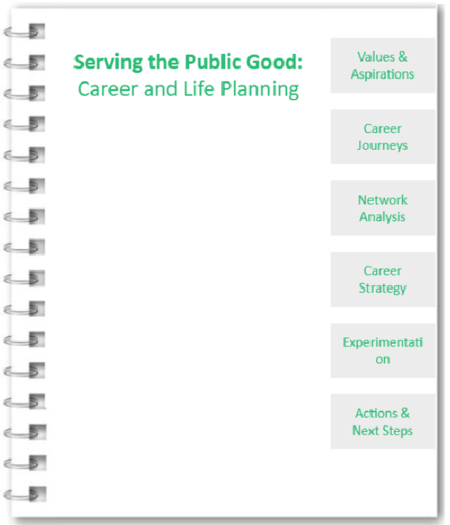
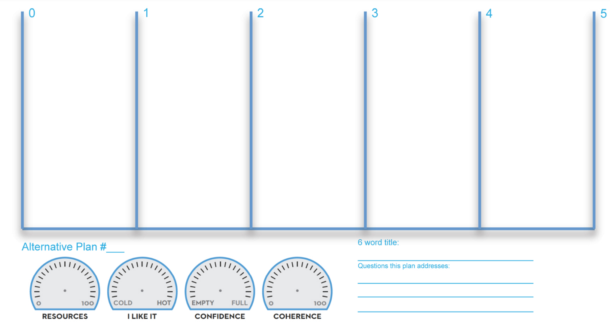

**<u>Class 2 Assignment</u>****<u>: Values & Aspirations</u>**

**a) Work View and Life View**

Please read pg. 31-38 in *Designing Your Life* for background. To recap, a workview addresses the critical issues related to what work is and what it means to you, while a lifeview is simply your ideas about the world and how it works. Next, fill out the section below with your work and life view.

||
||
||

||
||
||

**b) What you think the world needs the most**

Think about what you think the world needs the most. If you’re feeling lost, read the 80,000 hours [*<u>Problem Framework</u>*](https://80000hours.org/articles/problem-framework/) and reflect below. For a list of ideas, visit the 80000hours.org [*<u>List of Pressing World Problems</u>*](https://80000hours.org/problem-profiles/)

||
||
||

**c) What are you good at**

||
||
||

**d) Risk Tolerance**

Please reflect on how comfortable you feel navigating uncertainty and ambiguity in your career.

||
||
||

**💡OUTPUT: Your Overall Guiding Values and Strengths**

Please write a few sentences on your overall guiding values, strengths based on what you learned in the Work & Life View, What the world needs the most, Career Values, and Risk Tolerance exercises. You will refer back to this later in the workbook.

||
||
||

**<u>Class 2: Possible Career Journeys</u>**

**a) Career Anchors**

Career Anchors is a diagnostic tool developed by Edgar Schein that allows you to determine your values and what is important to you in your career. There are eight career anchors. Your results give you a window into what you are good at, what you value, and what motivates you.

[<u>Please click this link</u>](https://canvas.harvard.edu/courses/146462/files/folder/Selected%20Readings?preview=20990812) and do the career anchors exercise. This is a Canvas link that will enable the download of the book chapter. Please read the short book chapter and do the assessment. You might even want to print the pages if you want. At the end of the chapter, you will find a description of the categories.

| **Your career anchor scores:**  |
|---------------------------------|
| Life Style                      |
| Pure Challenge                  |
| General Managerial Competence   |
| Security/Stability              |
| Technical/Functional Competence |
| Autonomy/Independence           |
| Entrepreneurial Creativity      |
| Service/Dedication to a Cause   |

**b) Career Odyssey Planning**

Odyssey Planning is an exercise by Bill Burnett & Dave Evans that involves creating three different versions of the next five years of your life**. Please read pg. 90-103 in *Designing Your Life*** for instructions on this exercise. Thereafter, create your ***three*** Career Odyssey plans using the [**<u>template linked here</u>**](https://designingyour.life/wp-content/uploads/2023/11/DYL-Odyssey-Planning-Worksheet-v21.pdf) from the book. *Note: it may be easier to print the page and do the exercise by hand.*

**c) Option Evaluation**

We will use the three Career Odyssey plans from step b above and reflect on the options. Do you know enough yet to narrow down these choices? If not, this semester is a chance to refine your understanding of yourself and your options.

||
||
||

**💡OUTPUT: Moving Forward Hypothesis**

Do you have a clear view which of the three Career Odyssey plans you will move forward with? If not, which one(s) will you explore further in this course? It’s OK to not be sure, this is an iterative process!

Write down which career odyssey(s) you think you might want to focus on at present in this course:

| **Career Odyssey to Explore Further at Present:** |
|---------------------------------------------------|
|                                                   |

**<u>Class</u>** **<u>3: Networking and Career Learning</u>**

**Practicing Networking: HKS Alumni Interviews**

One of the assignments in our class is to interview 3 HKS alumni and learn about their career journeys. Here is a list of potential questions you can use:

- Tell me about the job, what does it really mean?

- What do you like about it?

- What frustrates you?

- How did you get to this job? What was the sequencing? What skills and network levers were required?

- What advice would you give me if I were interested in a role like this?

- Are there other similar roles that would also be interesting?

- Who else can I talk to to learn more?

- What’s the career path after this role?

- What are the financial and work-life balance impacts of this job?

- As a student at HKS what could I be doing?

Please write down the names of the 3 alumni you interviewed and a summary of what you learned:

||
||
||
||
||
||

**Your 3 Network Contact interviews (return here when you do it)**

Please write down the names of the 3 network contacts you interviewed and what you learned:

||
||
||
||
||
||

**a) Networking Goals**

Now, please identify three professional goals you’d like to achieve through networking (example: Find a potential co-founder, learn tips for how to manage family and work).

| **Networking Goals** |
|----------------------|
| **Goal 1**           |
| **Goal 2**           |
| **Goal 3**           |

**b) Strong Tie Network**

Please enter up to 15 names of people from your **existing personal and professional network** that could help you learn more about or move towards the above goals. Write a list for each goal. Make sure it’s **specific people’s names**, not groups or associations!

*Tip: Strong Tie connections are different from Weak Tie connections in that you have an existing relationship with them and you would say they know you beyond just an acquaintance level.*

<table style="width:69%;">
<colgroup>
<col style="width: 34%" />
<col style="width: 34%" />
</colgroup>
<thead>
<tr>
<th colspan="2" style="text-align: center;"><strong>Personal Contacts List (e.g. friends, relatives)</strong></th>
</tr>
<tr>
<th style="text-align: center;"></th>
<th style="text-align: center;"><strong>Goal 1</strong></th>
</tr>
<tr>
<th rowspan="8" style="text-align: center;">Names of individuals</th>
<th style="text-align: center;"></th>
</tr>
<tr>
<th style="text-align: center;"></th>
</tr>
<tr>
<th style="text-align: center;"></th>
</tr>
<tr>
<th style="text-align: center;"></th>
</tr>
<tr>
<th style="text-align: center;"></th>
</tr>
<tr>
<th style="text-align: center;"></th>
</tr>
<tr>
<th style="text-align: center;"></th>
</tr>
<tr>
<th style="text-align: center;"></th>
</tr>
<tr>
<th colspan="2" style="text-align: center;"><strong>Professional Contacts List (e.g. coworkers, managers, former clients)</strong></th>
</tr>
<tr>
<th style="text-align: center;"></th>
<th style="text-align: center;"></th>
</tr>
<tr>
<th style="text-align: center;"></th>
<th style="text-align: center;"></th>
</tr>
<tr>
<th style="text-align: center;"></th>
<th style="text-align: center;"></th>
</tr>
<tr>
<th style="text-align: center;"></th>
<th style="text-align: center;"></th>
</tr>
<tr>
<th style="text-align: center;"></th>
<th style="text-align: center;"></th>
</tr>
<tr>
<th style="text-align: center;"></th>
<th style="text-align: center;"></th>
</tr>
<tr>
<th style="text-align: center;"></th>
<th style="text-align: center;"></th>
</tr>
<tr>
<th style="text-align: center;"></th>
<th style="text-align: center;"></th>
</tr>
</thead>
<tbody>
</tbody>
</table>

**c) Weak Tie Network**

Make a list of up to 5 potential networks, groups, associations, etc that you can explore for each goal to meet new individuals (example: Harvard alumni association).

<table style="width:99%;">
<colgroup>
<col style="width: 33%" />
<col style="width: 33%" />
<col style="width: 33%" />
</colgroup>
<thead>
<tr>
<th colspan="3" style="text-align: center;"><strong>New Networks to Explore</strong></th>
</tr>
<tr>
<th style="text-align: center;"></th>
<th style="text-align: center;"><strong>Goal 1</strong></th>
<th style="text-align: center;"><strong>Goal 2</strong></th>
</tr>
<tr>
<th rowspan="5" style="text-align: center;">Names of specific networks, groups, associations, etc. to explore</th>
<th style="text-align: center;"></th>
<th style="text-align: center;"></th>
</tr>
<tr>
<th style="text-align: center;"></th>
<th style="text-align: center;"></th>
</tr>
<tr>
<th style="text-align: center;"></th>
<th style="text-align: center;"></th>
</tr>
<tr>
<th style="text-align: center;"></th>
<th style="text-align: center;"></th>
</tr>
<tr>
<th style="text-align: center;"></th>
<th style="text-align: center;"></th>
</tr>
</thead>
<tbody>
</tbody>
</table>

**💡OUTPUT: Moving Forward Hypothesis**

Now, let’s make a commitment to grow your networks! Write down what concrete steps you will take to cultivate your strong and weak tie networks this semester:

| **Individuals you will reach out to:**             |
|----------------------------------------------------|
|                                                    |
| **Steps you will take to cultivate new networks:** |
|                                                    |

**<u>Class 3</u>****<u>: Career Strategy</u>**

**a) Knowhow Gaps**

Please refer back to your Career Odyssey templates from section 2.

List 2-4 types of knowledge you will need in your future career (or multiple career path options), and identify the **time horizon** for acquiring the knowledge as well as how **urgent and important** it is for you to address these gaps in knowhow.

||
||
||
||
||
||
||
||

**Knowhow Development Plan**

Brainstorm options for how to develop competency in each of the above areas. Make a plan for each number you wrote above - can you take a class at HKS? Take on a side-project? Read a book?

<table>
<colgroup>
<col style="width: 7%" />
<col style="width: 92%" />
</colgroup>
<thead>
<tr>
<th colspan="2" style="text-align: center;">Knowhow Development Plan</th>
</tr>
<tr>
<th style="text-align: right;">1.</th>
<th></th>
</tr>
<tr>
<th style="text-align: right;">2.</th>
<th></th>
</tr>
<tr>
<th style="text-align: right;">3.</th>
<th></th>
</tr>
<tr>
<th style="text-align: right;">4.</th>
<th></th>
</tr>
<tr>
<th style="text-align: right;">5.</th>
<th></th>
</tr>
</thead>
<tbody>
</tbody>
</table>

**b) Life Factors**

What life factors might impact your career plans, positively or negatively? How can you proactively take steps to mitigate any negative effects and achieve a balance with your career goals?

<table>
<colgroup>
<col style="width: 35%" />
<col style="width: 64%" />
</colgroup>
<thead>
<tr>
<th colspan="2" style="text-align: center;">Life Factors</th>
</tr>
<tr>
<th><ul>
<li>
How might your <u>personal goals and interests</u> be impacted by your career plans?
</li>
</ul></th>
<th></th>
</tr>
<tr>
<th><ul>
<li>
How might your <u>family</u> be impacted by your career plans?
</li>
</ul></th>
<th></th>
</tr>
<tr>
<th><ul>
<li>
How is your <u>wellbeing</u> now and how might it be impacted by your career plans?
</li>
</ul></th>
<th></th>
</tr>
<tr>
<th><ul>
<li>
How much <u>risk</u> and <u>disruption</u> can you take right now? Why?
</li>
</ul></th>
<th></th>
</tr>
</thead>
<tbody>
</tbody>
</table>

**c) Roadblock Analysis**

What roadblocks do you anticipate encountering on your future career path? How strongly might this impact your plans? How can you proactively take steps to mitigate any negative effects?

||
||
||
||
||
||

**<u>Class</u>** **<u>4: Experimentation</u>**

Experimentation in career planning involves testing out a direction or environment to gather data on how it feels to you before fully committing. Use the template below to lay out your thoughts on two experiments you can try out this year (e.g., interning at the UN, writing for student newspaper).

<table>
<colgroup>
<col style="width: 20%" />
<col style="width: 79%" />
</colgroup>
<thead>
<tr>
<th colspan="2" style="text-align: center;"><strong>Experiment 1 Name:__________________________</strong></th>
</tr>
<tr>
<th><strong>What are you hoping to find out?</strong></th>
<th></th>
</tr>
<tr>
<th><strong>Where are you going in order to learn more?</strong></th>
<th></th>
</tr>
<tr>
<th><strong>What are you doing there?</strong></th>
<th></th>
</tr>
<tr>
<th><strong>How much time will you commit? (e.g. summer break, 4 hours a week)</strong></th>
<th></th>
</tr>
</thead>
<tbody>
</tbody>
</table>

<table style="width:100%;">
<colgroup>
<col style="width: 20%" />
<col style="width: 79%" />
</colgroup>
<thead>
<tr>
<th colspan="2" style="text-align: center;"><strong>Experiment 2 Name:__________________________</strong></th>
</tr>
<tr>
<th><strong>What are you hoping to find out?</strong></th>
<th></th>
</tr>
<tr>
<th><strong>Where are you going in order to learn more?</strong></th>
<th></th>
</tr>
<tr>
<th><strong>What are you doing there?</strong></th>
<th></th>
</tr>
<tr>
<th><strong>How much time will you commit? (e.g. summer break, 4 hours a week)</strong></th>
<th></th>
</tr>
</thead>
<tbody>
</tbody>
</table>

**<u>Class</u>** **<u>6: Next Steps/Actions</u>**

Reflect on 2-3 things you will do differently based on the course:

| **Things to do differently** |
|------------------------------|
|                              |

Please review the learnings in the section below. What can you commit to DOING *NOW*?

(E.g. attend a coaching session, browse LinkedIn, take a class)

| **Specific actions to take in the next 6 months** |
|---------------------------------------------------|
| **Action 1**                                      |
| **Action 2**                                      |
| **Action 3**                                      |
| **Action 4**                                      |
| **Action 5**                                      |

Workbook Material References:

1.  Burnett, B., & Evans, D. (2016). *Designing Your Life: How to Build a Well-Lived, Joyful Life* (Illustrated ed.). Knopf.

2.  Schein, E. H., & Maanen, V. J. (2013). *Career Anchors: The Changing Nature of Careers Self Assessment* (4th ed.). Pfeiffer.

3.  Ibarra, H. (2004). *Working Identity: Unconventional Strategies for Reinventing Your Career*. Harvard Business School Press.

4.  Knowdell Career Planner, Career Values Sorting Exercise [<u>https://www.careerplanner.com/index.cfm</u>](https://www.careerplanner.com/index.cfm)

5.  Lyubomirsky, S. (2013). *The how of happiness: A practical guide to getting the life you want*. Piatkus Books.

6.  Seligman, M. E. P. (2012). *Flourish: A visionary new understanding of happiness and well-being.* Atria Books.

7.  Todd, B. (2022, July 7). *A framework for comparing global problems in terms of expected impact*. 80,000 Hours.

> Retrieved July 26, 2022, from [<u>https://80000hours.org/articles/problem-framework/</u>](https://80000hours.org/articles/problem-framework/)

8.  Todd, B. (2022, July 7). *What are the most pressing world problems?* 80,000 Hours.

> Retrieved July 26, 2022, from [<u>https://80000hours.org/problem-profiles/</u>](https://80000hours.org/problem-profiles/)
